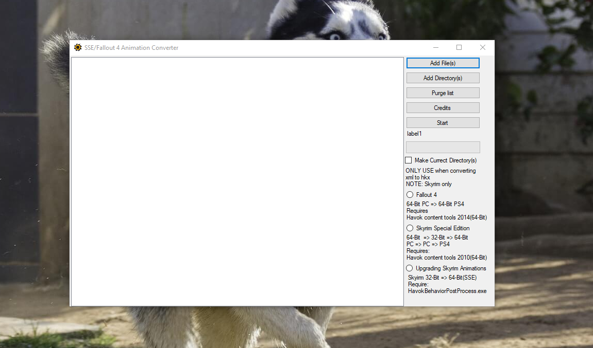

# SSE-Fallout-4-Animation-Converter
Check the changelog.MD for more info
This Tool can convert given Animation(s) to PS4 format

Please note: this is beta and bugs are posable so please do report them

Requirements:

Havok Content Tools 2010

Havok Content Tools 2014

HavokBehaviorPostProcess.exe found in the creation kit for Skyrim Special Edition

hkxcmd found on the nexus https://www.nexusmods.com/skyrim/mods/1797

How to install the required files:

step one(1): copy all the required files to the "Data" and the havok content tools to there respective folder

You are done use the tool as you wish
